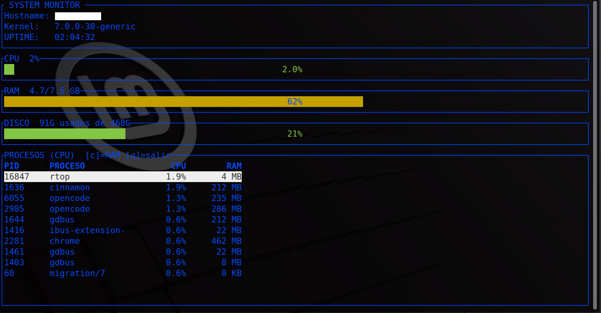

# rtop

**Monitor de sistema interactivo para la terminal**, inspirado en `htop`, escrito en **Rust** como proyecto de aprendizaje.



---

## Características

- **CPU**: uso global en tiempo real (muestreado de `/proc/stat`)
- **RAM**: total, usada, disponible y porcentaje (`/proc/meminfo`)
- **Disco**: uso de la partición raíz (`df`)
- **Uptime**: tiempo de actividad del sistema (HH:MM:SS)
- **Procesos**: lista con PID, nombre, %CPU y memoria (vía `sysinfo`)
- **Barras de progreso** con colores semánticos:
  - 🟢 Verde < 60%
  - 🟡 Amarillo 60–85%
  - 🔴 Rojo > 85%
- **Ordenación** por CPU o RAM (tecla `c`)
- **Navegación** con teclado (↑/↓ o j/k)
- **Panel de detalle** por proceso (tecla `Enter`)
- **Interfaz TUI** fluida con `ratatui` + `crossterm`

---

## Requisitos del sistema

- **Linux** (kernel 5.x+) — el programa lee `/proc` y ejecuta `df`
- Arquitecturas soportadas: **x86_64** y **ARM64** (aarch64)
- Rust 1.70+ para compilar desde código fuente

> ⚠️ **No soportado**: Windows, macOS, *BSD. El código accede directamente a `/proc` y comandos Linux.

---

## Instalación

### Binarios precompilados (recomendado)

Descarga la última versión desde [GitHub Releases](https://github.com/TU_USUARIO/rtop/releases):

```bash
# Linux x86_64
wget https://github.com/TU_USUARIO/rtop/releases/latest/download/rtop-linux-x86_64.tar.gz
tar -xzf rtop-linux-x86_64.tar.gz
sudo mv rtop /usr/local/bin/

# Linux ARM64 (Raspberry Pi, etc.)
wget https://github.com/TU_USUARIO/rtop/releases/latest/download/rtop-linux-arm64.tar.gz
tar -xzf rtop-linux-arm64.tar.gz
sudo mv rtop /usr/local/bin/
```

### Desde crates.io (cuando se publique)

```bash
cargo install rtop
```

### Desde código fuente

```bash
git clone https://github.com/TU_USUARIO/rtop.git
cd rtop
cargo build --release
# El binario estará en target/release/rtop
sudo cp target/release/rtop /usr/local/bin/
```

---

## Uso

```bash
rtop
```

La interfaz se actualiza cada segundo. Controles:

| Tecla | Acción |
|-------|--------|
| `↑` / `k` | Subir en la lista de procesos |
| `↓` / `j` | Bajar en la lista de procesos |
| `c` | Alternar orden: CPU ↔ RAM |
| `Enter` | Ver detalle del proceso seleccionado |
| `Esc` | Volver a la lista (desde detalle) |
| `q` / `Ctrl+C` | Salir del programa |

---

## Configuración

Por ahora no hay archivo de configuración. La configuración se hace en tiempo de ejecución mediante teclas. Futuras versiones podrían añadir:
- Archivo de configuración (`~/.config/rtop/config.toml`)
- Temas de colores personalizables
- Intervalo de refresco configurable

---

## Compilación

### Requisitos

- Rust 1.70+ (`rustup install stable`)
- Dependencias de sistema para compilar `crossterm` y `ratatui`:
  ```bash
  # Debian/Ubuntu/Mint
  sudo apt install pkg-config libxcb-shape0-dev libxcb-xfixes0-dev libxcb-render0-dev libxcb-shape0-dev libxcb-xfixes0-dev libasound2-dev
  # Fedora
  sudo dnf install pkg-config libxcb-devel alsa-lib-devel
  ```

### Compilar en modo release (optimizado)

```bash
cargo build --release
```

El ejecutable optimizado estará en `target/release/rtop`.

### Verificaciones recomendadas antes de publicar

```bash
cargo fmt       # Formato de código estándar
cargo clippy    # Lints y buenas prácticas
cargo check     # Comprobación rápida de tipos
cargo test      # Tests (si existen)
```

---

## Contribución

¡Las contribuciones son bienvenidas! Proceso sugerido:

1. Haz *fork* del repositorio
2. Crea una rama: `git checkout -b feature/mi-mejora`
3. Haz tus cambios y asegúrate de que pasen:
   ```bash
   cargo fmt --check
   cargo clippy -- -D warnings
   cargo test
   ```
4. Haz *commit* con mensajes claros (Convencionales: `feat:`, `fix:`, `docs:`, `refactor:`)
5. Abre un *Pull Request* describiendo el cambio

Ideas para contribuir:
- Añadir soporte multi-plataforma completo (Windows/macOS via `sysinfo`)
- Temas de colores personalizables
- Filtro/búsqueda de procesos
- Gráficos de historial (sparkline)
- Configuración persistente

---

## Licencia

Distribuido bajo la **licencia MIT**. Ver `LICENSE` para más detalles.

---

## Autor

Marcos-Spectro — (https://github.com/MarcosSpectro)

Proyecto de aprendizaje de Rust y sistemas Linux.
